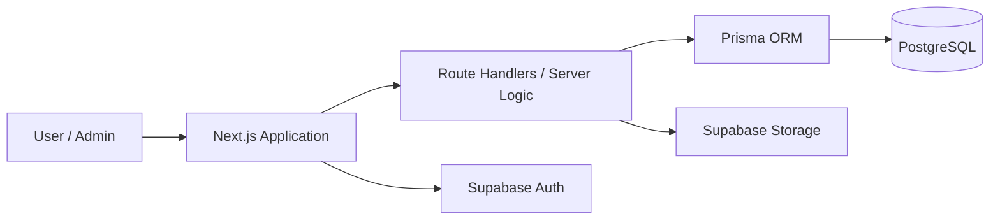
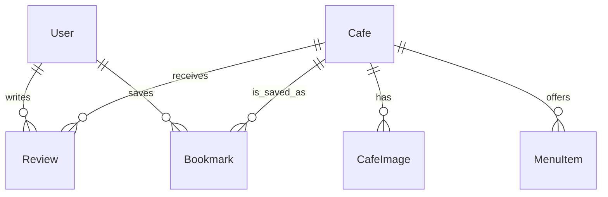
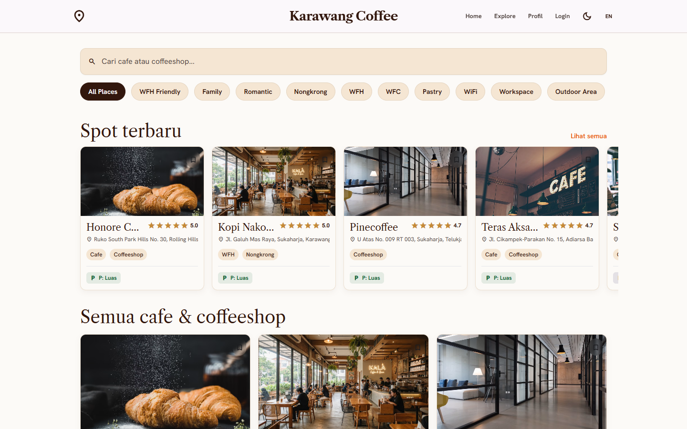
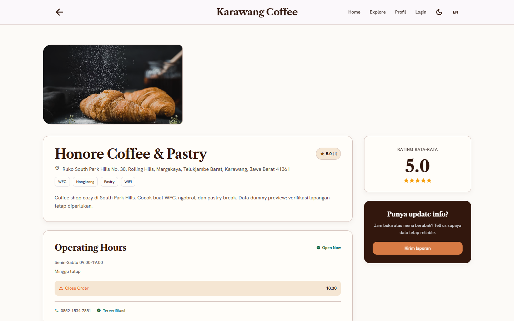

# Coffee Karawang

Full-stack cafe discovery platform for exploring coffee shops in Karawang.

**Live:** https://kopikarawang.my.id

**Repository:** https://github.com/chandra7251/coffe_karawang
**Stack:** Next.js · TypeScript · PostgreSQL · Prisma · Supabase

## Overview

Coffee Karawang helps residents and visitors find cafes and coffee shops in Karawang without relying on scattered social posts or incomplete listings. Users can search and filter venues, inspect details and menus, save favorites, submit reviews, and open location information.

It is built as a full-stack application: a Next.js user experience and admin panel sit on top of route handlers, Prisma-managed PostgreSQL data, Supabase authentication, and Supabase Storage for cafe media.

## Features

### User

- Browse, search, and filter cafe and coffee shop listings.
- View cafe details, facilities, opening information, menus, photos, reviews, ratings, and location links.
- Save and remove cafe bookmarks from a personal profile.
- Submit reviews and ratings for cafes.
- Browse venue locations through map directory views.
- Update profile name, avatar, biography, and interest tags.

### Authentication

- Google and Discord sign-in through Supabase Auth.
- Local profile record creation after first OAuth sign-in.
- User-edited profile name and avatar remain authoritative after later OAuth sign-ins.
- Role-based user and administrator access.

### Admin

- Create, edit, and manage cafe listings.
- Manage venue photos separately from popular menu items.
- Upload validated cafe and menu images to Supabase Storage.
- Moderate reviews, inspect anomaly flags, and blacklist suspicious users.

### Validation and reliability

- Zod validation for request payloads on supported routes.
- Route-level authorization for protected user and admin actions.
- Rate limiting for selected write endpoints.
- File type, size, and image-signature checks for uploads.
- Review anomaly flags excluded from normal cafe review output.

## Architecture



Next.js serves both public and administrative interfaces. Route handlers enforce application rules, Prisma accesses PostgreSQL, Supabase Auth owns OAuth sessions, and Supabase Storage stores uploaded cafe media.

## Tech Stack

| Layer | Technology |
| --- | --- |
| Frontend | Next.js, React, TypeScript |
| Server | Next.js App Router and Route Handlers |
| Styling | Tailwind CSS |
| Database | PostgreSQL |
| ORM | Prisma |
| Authentication | Supabase Auth with Google and Discord OAuth |
| Media storage | Supabase Storage |
| Validation | Zod |
| Testing | Vitest, Testing Library, jsdom |
| Production | Self-hosted VPS, custom domain, HTTPS |

Production infrastructure is currently managed separately from this application repository.

## Project Structure

```text
app/        Next.js pages, layouts, UI components, and route handlers
lib/        Shared server utilities, authentication, database, filters, and rate limiting
prisma/     Prisma schema and local development seed script
supabase/   Versioned Supabase database migrations and local Supabase configuration
test/       Vitest coverage for filters, reviews, profile sync, migrations, and canonical URL config
docs/       Project documentation and screenshot placeholders
public/     Static assets served by Next.js
```

## Data Model

Core Prisma models:

- `User` — authenticated profile, role, blacklist state, reviews, and bookmarks.
- `Cafe` — venue details, facilities, categories, tags, location data, aggregate rating, and verification state.
- `CafeImage` — cafe location and ambience media.
- `MenuItem` — cafe menu entries, pricing, availability, and popular-menu media.
- `Review` — user rating, comment, image references, and anomaly state.
- `Bookmark` — a user's saved cafe relation.



## Authentication and Authorization

Coffee Karawang uses Supabase Auth for Google and Discord OAuth. After the first successful sign-in, server logic creates an application `User` profile from provider metadata when needed. On later sign-ins, user-controlled profile fields are not overwritten by OAuth metadata changes.

Application roles are `USER` and `ADMIN`. Protected profile actions require an authenticated user; admin routes and mutations require administrator authorization. OAuth provider credentials and Supabase service credentials remain environment-only configuration.

## Screenshots

Home and cafe-detail captures use the live application at a consistent 1440×900 viewport. Add a real authenticated admin-dashboard capture at the remaining path:

### Home


### Cafe Detail


### Admin Dashboard


## Getting Started

### Prerequisites

- Node.js 20 or later
- npm
- A PostgreSQL database and Supabase project
- Supabase CLI for local database work or linked migration deployment

### Install and run

```bash
git clone https://github.com/chandra7251/coffe_karawang.git
cd coffe_karawang
npm install
```

Copy the environment template, then replace placeholder values with your own project configuration:

```powershell
Copy-Item .env.example .env
```

Generate Prisma Client and start development:

```bash
npx prisma generate
npm run dev
```

The app starts on `http://localhost:3000` unless another port is selected.

## Environment Variables

Create `.env` from `.env.example`. Never commit production secrets.

| Variable | Purpose |
| --- | --- |
| `DATABASE_URL` | Pooled PostgreSQL connection used by Prisma |
| `DIRECT_URL` | Direct PostgreSQL connection used by Prisma tooling |
| `NEXT_PUBLIC_SUPABASE_URL` | Supabase project URL exposed to the browser |
| `NEXT_PUBLIC_SUPABASE_ANON_KEY` | Supabase anonymous key exposed to the browser |
| `SUPABASE_SERVICE_KEY` | Server-only Supabase service key for privileged storage work |
| `ADMIN_EMAILS` | Comma-separated emails permitted to receive administrator access |

## Database Migrations

The database contract is defined by `prisma/schema.prisma` and versioned Supabase SQL migrations in `supabase/migrations/`.

For a linked Supabase project, apply reviewed migrations with:

```bash
npx supabase db push --linked
```

Check local and remote migration history with:

```bash
npx supabase migration list
```

Do not use `prisma db push` against production. Production schema changes should be introduced as additive, reviewed Supabase migrations and applied through the Supabase migration workflow.

## Testing and Validation

Run the test suite:

```bash
npm run test
```

Run TypeScript and production build checks:

```bash
npx tsc --noEmit
npm run build
```

Current tests cover cafe filtering, review behavior, OAuth profile persistence, Prisma/Supabase migration alignment, and canonical production-domain configuration.

## Production

**Production URL:** https://kopikarawang.my.id

The application runs on a self-hosted VPS behind a custom HTTPS domain. Deployment, web-server, and infrastructure configuration are managed separately from this repository.

For OAuth configuration, the canonical production URL is `https://kopikarawang.my.id`; localhost remains valid for development callbacks.

## Current Limitations

- Rate limiting currently uses in-memory state, so limits are not shared across multiple application instances.
- Infrastructure configuration is not version-controlled in this repository.
- Screenshot files still need to be captured from the live application and added under `docs/screenshots/`.

## Roadmap

- Move rate-limit state to shared infrastructure when scaling beyond one instance.
- Version deployment configuration alongside the application.
- Add CI checks for tests, TypeScript, build, and migration consistency.
- Expand automated API and end-to-end coverage.
- Add structured application logging and production observability.

## Author

Chandra Aditiya Putra

Full-Stack Developer

GitHub: https://github.com/chandra7251

Live project: https://kopikarawang.my.id

## License

This project is licensed under the MIT License. See [LICENSE](LICENSE).
